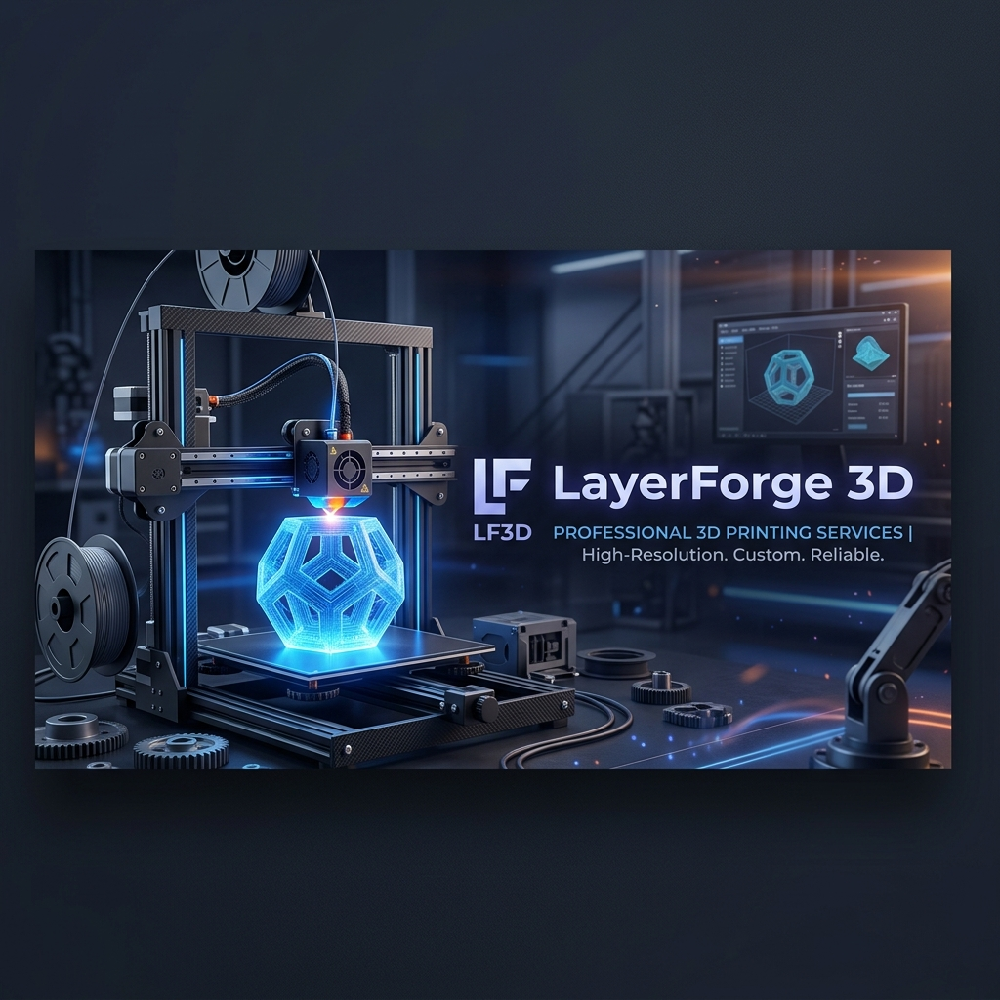

# LayerForge 3D — Full Stack Monorepo



Welcome to **LayerForge 3D**, a premium, end-to-end e-commerce and 3D printing service platform. This project leverages the **MERN stack** (MongoDB, Express, React Native, Node.js) to deliver a high-performance, visually stunning experience for both customers and administrators.

### 🔗 Live Deployment Links
*   **🌐 Frontend App (Web):** [layerforge3d.vercel.app](https://layerforge3d.vercel.app/)
*   **⚙️ Backend API:** [threedink-studio.onrender.com](https://threedink-studio.onrender.com)

---


## ✨ Key Features

### 🛒 Seamless E-Commerce
- **Product Discovery**: Browse a curated catalogue of 3D-printed products with high-quality imagery and detailed specifications.
- **Cart Management**: Add, remove, and manage items in a persistent shopping cart.
- **Secure Checkout**: Streamlined order placement process for a frictionless user experience.

### 🖨️ Custom 3D Printing Wizard
- **STL Upload Support**: Users can upload `.stl` files directly for custom print requests.
- **Material Selection**: Choose from various materials including **PLA, ABS, and Resin**.
- **Print Configuration**: Customize infill, layer height, and post-processing options to get an accurate quote.

### 🛡️ Security & Validation
- **JWT-Based Security**: Robust authentication using JSON Web Tokens.
- **Role-Based Access Control (RBAC)**: Distinct permissions and interfaces for **Customers** and **Administrators**.
- **Data Validation**: Comprehensive frontend and backend validation, including strict pattern matching for Sri Lankan phone numbers.

### 💼 Powerful Admin Dashboard
- **Cost Calculator**: Advanced tool for admins to calculate production costs (material, energy, machine time, labor) and generate optimized selling prices.
- **Order Tracking**: Real-time management of shop and custom orders, status updates, and tracking number assignment.
- **Content Management (CMS)**: Full CRUD capabilities for products, including image uploads and description editing.

---

## 🛠️ Tech Stack

| Layer | Technology |
| :--- | :--- |
| **Mobile App** | React Native + Expo SDK 54 |
| **Backend** | Node.js + Express 4 |
| **Database** | MongoDB + Mongoose 8 |
| **File Storage** | Multer (Local Storage) |
| **Authentication** | JWT (jsonwebtoken) + BcryptJS |
| **Networking** | Axios |
| **UI Components** | Custom Premium Components (Dark Slate & Indigo) |

---

## 📂 Repository Structure

```text
LayerForge-3D_WMT/
├── backend-node/       ← REST API (Node.js/Express)
│   ├── src/models/     (Mongoose schemas with business logic)
│   ├── src/routes/     (API route definitions)
│   ├── src/controllers/(Business logic & DB interaction)
│   ├── src/middleware/ (Auth, Validation, Image Uploads)
│   └── public/         (Static storage for images and STL files)
│
├── mobile/             ← React Native + Expo Application
│   ├── app/screens/    (UI views: Admin, Auth, Shop, Upload)
│   ├── app/context/    (State management: Auth, Cart)
│   ├── app/lib/        (Axios configuration & utilities)
│   └── app/data/       (Static data & constants)
│
└── assets/             ← Project branding & documentation assets
```

---

## 🚀 Quick Start

### 1. Prerequisites
- **Node.js** (v18+ recommended)
- **MongoDB** (Running locally or via Atlas)
- **Expo Go App** (Installed on your physical device)

### 2. Backend Setup
```bash
cd backend-node
npm install
npm run dev
```
*By default, the frontend is configured to use the **production backend** (`https://threedink-studio.onrender.com`). To test locally, update `API_BASE_URL` in `mobile/app/lib/config.js` to `http://localhost:8080`.*

### 3. Frontend Setup (Mobile/Web)
```bash
cd mobile
npm install
npx expo start
```
- **Web App**: Press `w` in the terminal to launch the web version in your browser. The backend is configured to accept dynamic CORS origins, making it suitable for deployment on Netlify/Vercel.
- **Physical Device**: Scan the QR code with your Expo Go app.

> [!TIP]
> **Network Configuration:** To test locally on a physical device with a local backend, update the `API_BASE_URL` in `mobile/app/lib/config.js` to your computer's local network IP address (e.g., `192.168.1.XXX:8080`).

---

## 🌐 API Overview

| Method | Endpoint | Access |
| :--- | :--- | :--- |
| `POST` | `/auth/register` | Public |
| `POST` | `/auth/login` | Public |
| `GET` | `/api/products` | Public |
| `POST/PUT/DELETE` | `/api/products/:id` | Admin |
| `GET/POST` | `/orders` | Authenticated |
| `POST` | `/api/uploads/stl` | Authenticated |
| `POST` | `/stl-orders/calculate` | Admin |

---

## 🎨 Design Philosophy
LayerForge 3D utilizes a **Premium Dark Aesthetic**. We prioritize visual excellence with:
- **Color Palette**: Deep Slate backgrounds with Indigo accents.
- **Typography**: Clean, modern sans-serif fonts for readability and professionalism.
- **Interactivity**: Smooth transitions, micro-animations, and responsive layouts.

---
